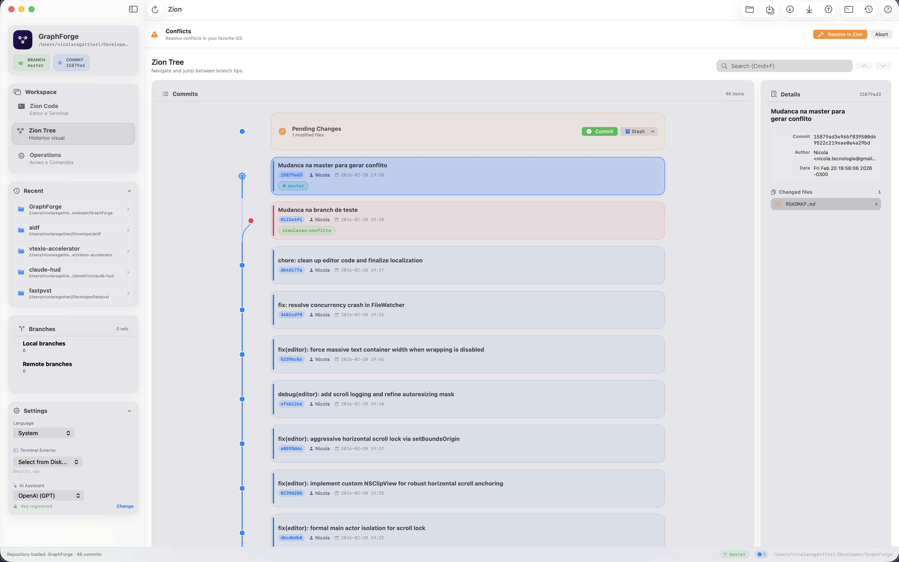

# Zion — Handoff Context

## What is Zion?

A native Git workspace for macOS (SwiftUI, Swift 6, macOS 14+). Combines a visual commit graph, code editor, terminal, and Git operations in one window.

- **Repo:** Swift Package (no Xcode project)
- **Build:** `swift build` / `swift run`
- **Release:** `./scripts/make-app.sh` → `dist/Zion.app`
- **DMG:** `./scripts/make-dmg.sh` → `dist/Zion.dmg`
- **Localization:** Portuguese (BR), English, Spanish — via `.lproj` files and `L10n()` helper

---

## README Rewrite — Status

### Done

- **New positioning**: "Git workspace" (not "Git client")
- **New tagline**: `Graph. Code. Terminal. One window.`
- **Sub-tagline**: `A native Git workspace for macOS that puts your commit graph, a real code editor, and a full terminal in one window.`
- **AI demoted** from headline to feature-level (no longer in intro paragraph)
- **"No Electron. No subscriptions. No bloat. Just Swift."** kept
- **Hero screenshots** (3-image row) — active, files exist:
  - `docs/screenshots/hero-graph.png`
  - `docs/screenshots/hero-code.png`
  - `docs/screenshots/hero-operations.png`
- **"Why Zion?" comparison table** — includes Conflicts row
- **Feature sections** all written:
  - Zion Tree (lane-colored cards, status bar pills mentioned)
  - Zion Code (syntax highlighting, blame, Quick Open, themes)
  - Smart Clipboard
  - Operations Center
  - **Conflict Resolution** (new section, placed after Operations Center)
  - AI Assistant (demoted from headline)
  - GitHub Integration
  - Worktree-First Workflow
- **Feature Reference table** — updated with Conflicts row, lane-colored cards, status bar pills
- **Sections kept as-is:** Install, Keyboard Shortcuts, Themes, Languages, Architecture, Contributing, License, Acknowledgments

### Pending — Screenshots

These 4 screenshots need to be captured and wired into the README. They are currently **commented out** with `<!-- -->` in the markdown so no broken images show.

| Screenshot | README Location | What to Capture |
|------------|----------------|-----------------|
| `docs/screenshots/blame-view.png` | Below "Zion Code" section (~line 55) | Git Blame view with author-colored gutter in the code editor |
| `docs/screenshots/clipboard-drawer.png` | Below "Smart Clipboard" section (~line 64) | Clipboard drawer panel showing auto-categorized items (commands, paths, hashes, URLs) |
| `docs/screenshots/conflict-resolver.png` | Below "Conflict Resolution" section (~line 78) | Conflict resolver screen: file list on left with red/green status, inline editor on right with ours (green) vs theirs (blue) highlighting |
| `docs/screenshots/quick-open.png` | Below "Worktree-First Workflow" section (~line 95) | Quick Open overlay (`Cmd+P`) showing fuzzy file search |

### How to Wire a Screenshot

1. Capture the screenshot in the app
2. Save/copy it to `docs/screenshots/{filename}.png`
3. Find the commented-out `` tag in `README.md` and **uncomment** it

Example — the conflict resolver block currently looks like:

```markdown
<!-- <p align="center">
  
</p> -->
```

After adding the file, change to:

```markdown
<p align="center">
  
</p>
```

---

## Project Architecture

```
ZionApp / ContentView          App shell, navigation, toolbar
  -> RepositoryViewModel       Central state (@Observable, @MainActor)
    -> RepositoryWorker        Background Git operations (async/await)
      -> GitClient             Git CLI process execution
    -> GitGraphLaneCalculator  Lane & edge layout algorithm
    -> TerminalSession         PTY management (SwiftTerm + LocalProcess)
    -> AIClient                Anthropic / OpenAI API (actor-isolated)
```

Pattern: **MVVM** with Swift Observation (`@Observable`).

## Key Technical Rules

### @Observable (NOT ObservableObject)

- Owner view: `@State private var model = RepositoryViewModel()`
- Child views with bindings: `@Bindable var model: RepositoryViewModel`
- Child views read-only: `var model: RepositoryViewModel`
- `@AppStorage` doesn't work in `@Observable` — use computed properties with `UserDefaults` directly
- `onChange` must use two-param form: `{ _, newValue in }`

### Light Themes in Dark Mode (GOLDEN RULE)

`EditorTheme.isDark` must ALWAYS return `true` for ALL themes. Use `isLightAppearance` for SwiftUI styling. Never apply `.environment(\.colorScheme)` to the SourceCodeEditor.

### NSTextView Rendering

- Use `NSTextView.scrollableTextView()` factory
- `usesAdaptiveColorMappingForDarkAppearance = false`
- `drawsBackground = true` with explicit `backgroundColor`
- Use `NSColor(srgbRed:green:blue:alpha:)` for text attributes — never bridge through SwiftUI Color

### Terminal

- SwiftTerm + real PTY via `LocalProcess`
- Login shell (`-l`) with `TERM=xterm-256color`
- All delegate callbacks → `DispatchQueue.main`

## Build & Test Workflow

After ANY code change:

```bash
./scripts/make-app.sh    # Rebuilds dist/Zion.app
open dist/Zion.app       # Test from the real app bundle
```

After big changes (distribution):

```bash
./scripts/make-dmg.sh    # Generates dist/Zion.dmg
```

## Design System

- **Glass aesthetic**: `ultraThinMaterial` + `GlassCard` containers
- **Tokens**: `DesignSystem.Colors` — `glassBorderDark`, `glassBorderLight`, `glassHover`, `glassSubtle`, `glassOverlay`, `dangerBackground`, `dangerBorder`
- **Cards**: `GlassCard` + `CardHeader("Title", icon: "sf.symbol")`
- **Danger zones**: `GlassCard(borderTint: DesignSystem.Colors.dangerBorder)`

## New Feature Checklist

1. Keyboard shortcut (hidden button pattern)
2. `.help()` tooltip with shortcut hint
3. L10n keys in all 3 locales (pt-BR, en, es)
4. Entry in `HelpSheet.swift` + `help.*` L10n keys
5. Update `docs/FEATURES.md`
