<div align="center">

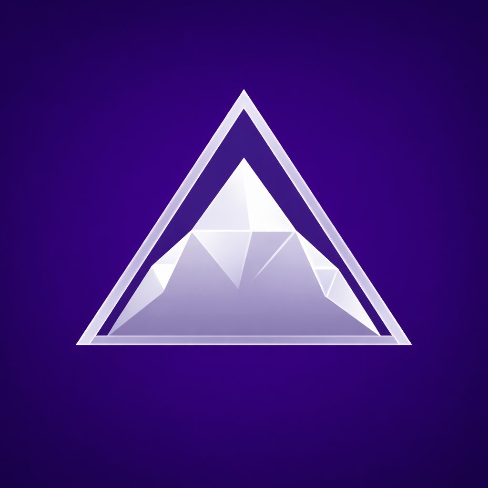

# Zion

*The view from the top.*

**Graph. Code. Terminal. AI. One window.**

The native macOS workspace where you run AI agents, review changes, and ship —
without switching apps. Split terminals, visual commit graph, code editor,
smart clipboard, mobile remote access, and 15 AI features. All in one window.

**Free. Native Swift. No Electron. No subscriptions.**

[](https://zioncode.dev)
[](https://www.apple.com/macos/sonoma/)
[](https://swift.org)
[](LICENSE)

</div>

<p align="center">
  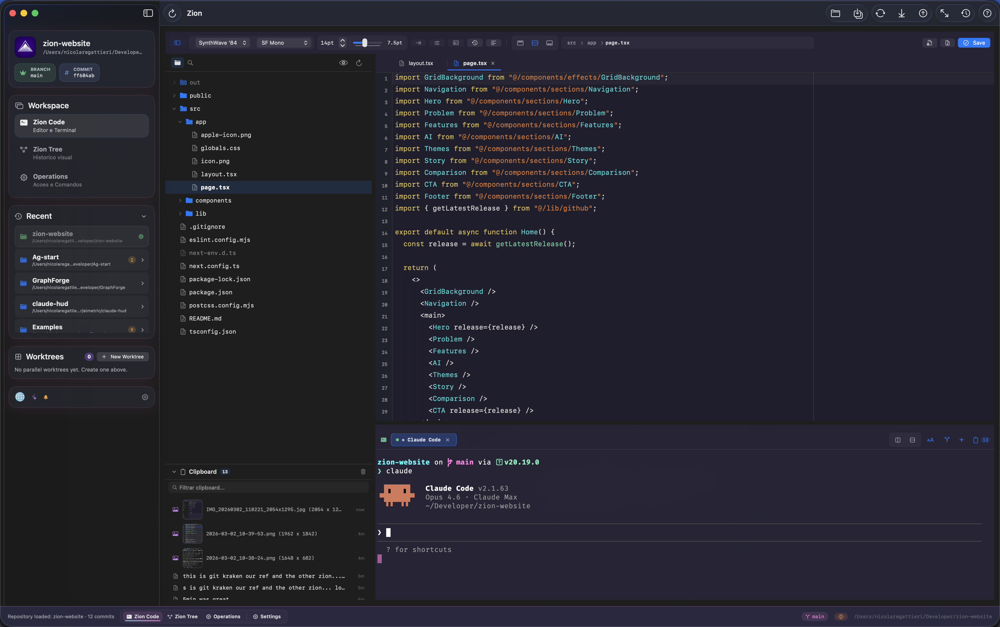
  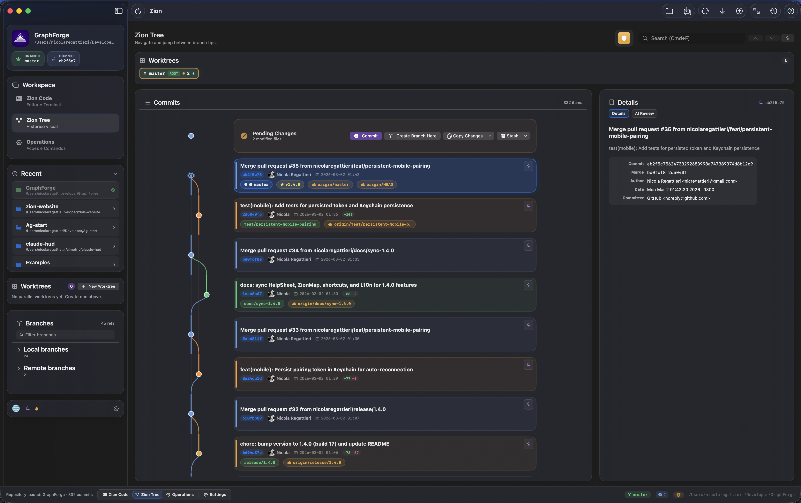
  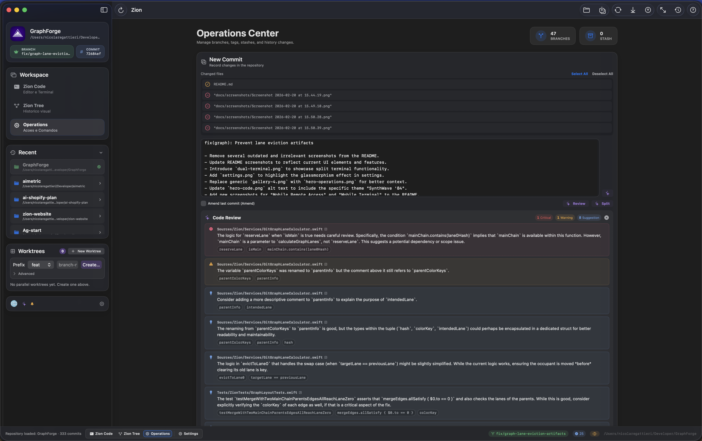
</p>

---

## Why Zion?

Everything running, everything visible, everything under your control.

| Capability | What you get |
|---|---|
| **Split Terminals** | Real PTY with tabs, horizontal/vertical splits, independent zoom — run Claude Code and Gemini side by side |
| **Code Editor** | Syntax highlighting, Git Blame with AI explanation, Quick Open, code formatter (16+ languages), go-to-definition |
| **Commit Graph** | Color-coded branch lanes with Bezier merge curves, search, jump bar, pending changes, up to 5,000 commits |
| **13 AI Features** | Commit messages, pre-commit review, diff explanation, conflict resolution, semantic search, blame explainer, PR drafts — Claude / GPT / Gemini |
| **Smart Clipboard** | Copy a hash → "Show in Graph". Copy a branch → one-click checkout. Copy a command → double-click executes. Auto-categorized. |
| **Mobile Access** | All terminal sessions across all projects, from your phone. Approve AI prompts remotely. AES-256-GCM encrypted. |
| **Recovery Vault** | Auto-snapshots before every destructive operation. Be aggressive with git — Zion has your back. |
| **Git Hosting** | GitHub + GitLab + Bitbucket + Azure DevOps with auto-detection from remote URLs |
| **Native macOS** | Pure SwiftUI. No Electron, no web views. Glassmorphism design with 7 themes. |
| **Free** | MIT licensed. No subscriptions. Your API keys, your machine. |

---

## What's New in 1.6.7

> See everything. Ship with confidence.

- **Zion Bridge** — AI portability flow for migrating AI configurations between repositories with migration console.
- **AI Modes** — Mode-aware routing (efficient/smart/bestQuality) with richer review context for different use cases.
- **Repo Memory** — AI snapshot cache for repository context, giving AI assistants better project awareness.
- **Azure DevOps** — Full hosting provider support alongside GitHub, GitLab, and Bitbucket.
- **Image Preview** — VS Code-like image preview in the file browser with zoom controls.
- **Graph Polish** — Stash helper commits collapsed, worktree ROOT/WT badges, improved lane rendering and pending changes.
- **Terminal Stability** — Selection preserved during streaming, split-pane drag fixes, scroll hover routing, and owner binding recovery.
- **Performance** — Adaptive throttling for background repo monitoring, scoped snapshots for faster repo switching, search debounce.

---

## Beautiful by Design

Zion is the only Git workspace that brings the modern macOS **Glassmorphism** (UltraThinMaterial) aesthetic to your developer workflow. Whether you prefer deep indigo, classic dark, or a clean light theme, Zion looks stunning on every Mac.

<p align="center">
  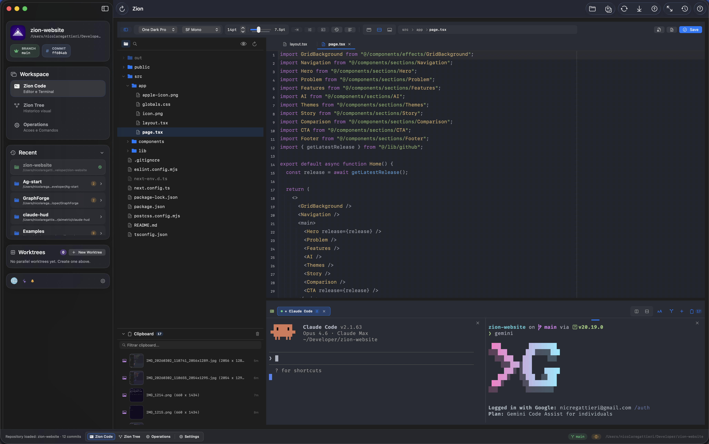
</p>
<p align="center">
  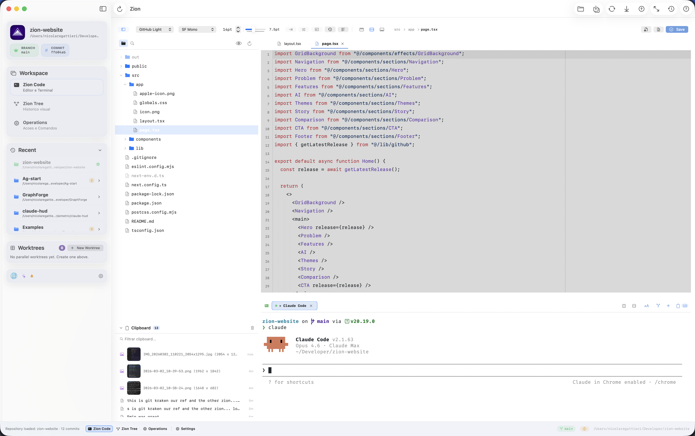
</p>


---

## Features at a Glance


### Zion Code — Editor + Terminal
> `Cmd+1`

A real code editor with syntax highlighting, Git Blame, Quick Open (`Cmd+P`), code formatter (16+ languages), file watcher, 7 themes (Dracula, Tokyo Night, Catppuccin Mocha, One Dark Pro, City Lights, GitHub Light, SynthWave '84), and configurable fonts. Side-by-side with a real PTY terminal that supports split panes, multiple tabs, independent zoom, Finder drag-and-drop, and inline image display.

<p align="center">
  
</p>

### Zion Tree — Visual Commit Graph
> `Cmd+2`

Lane-colored commit cards with colored left stripes matching branch lanes, merge edges, branch decorations, commit search with `Cmd+F`, jump bar for quick branch navigation, pending changes row at the top, status bar pills showing current branch and change count, GPG/SSH signature verification, and keyboard navigation with arrow keys.

<p>
  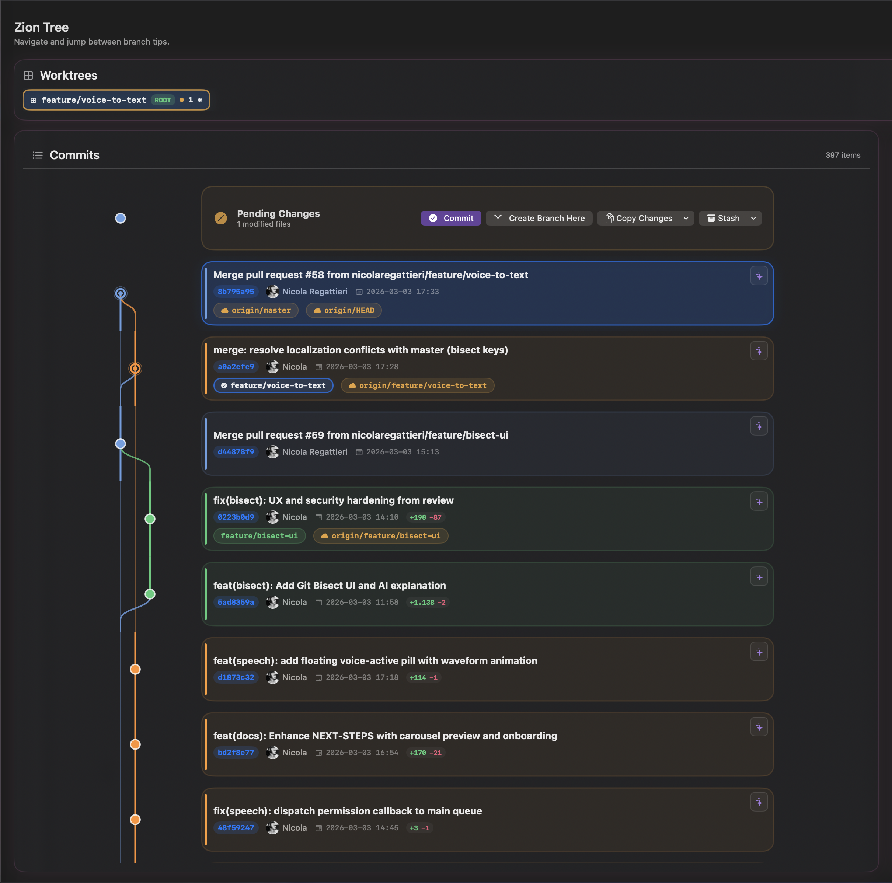
</p>

### Smart Clipboard
> It knows what you copied.

Copy a git hash — Zion offers "Show in Graph". Copy a branch name — one click checks it out. Copy a file path — opens in editor. Copy a command — double-click executes it. Everything auto-categorized with color codes. **Drag** items directly into any terminal pane. Keeps your last 20 items and auto-cleans temp files.

<p align="center">
  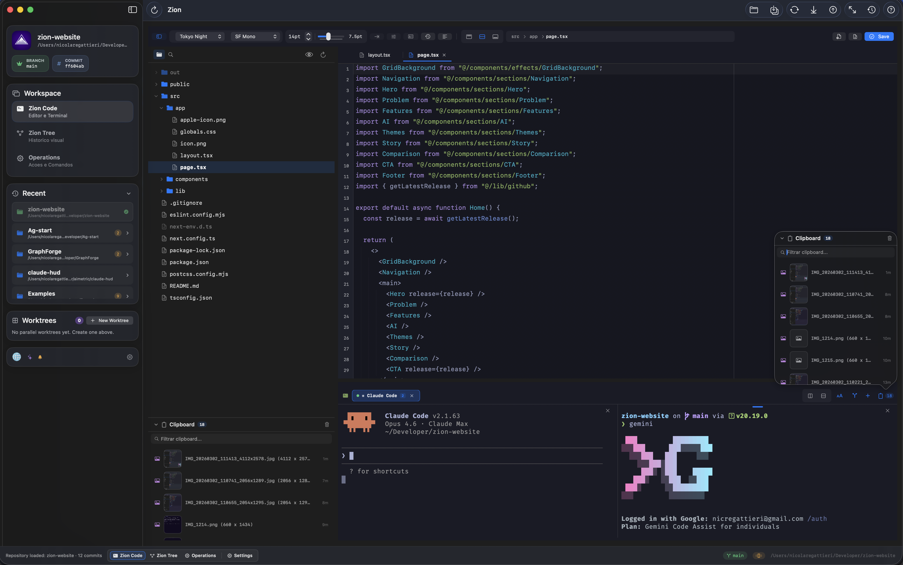
</p>

### Operations Center
> `Cmd+3`

A dashboard for everything Git. Commit with hunk and line-level staging, interactive rebase (pick/squash/fixup/drop/reorder with drag), branch management (create/merge/rebase/rename/delete), stash management, cherry-pick, revert, reset, annotated/signed tag management, worktrees, submodules, remotes, reflog, and repo stats — all in one place.

<p align="center">
  
</p>

### Mobile Remote Access
> Monitor your Mac from anywhere.

Scan a QR code to pair your phone with Zion. See live terminal output with full ANSI colors powered by xterm.js. Approve, deny, or abort AI prompts. Switch between terminal sessions across all open projects. Works over Cloudflare Tunnel (remote) or LAN (local Wi-Fi). All communication encrypted with AES-256-GCM.

<p align="center">
  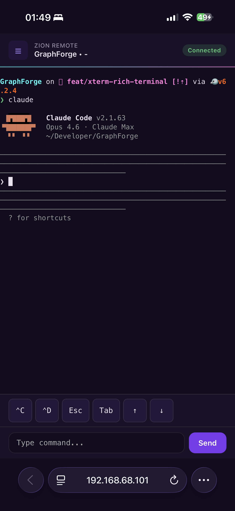
  &nbsp;&nbsp;&nbsp;
  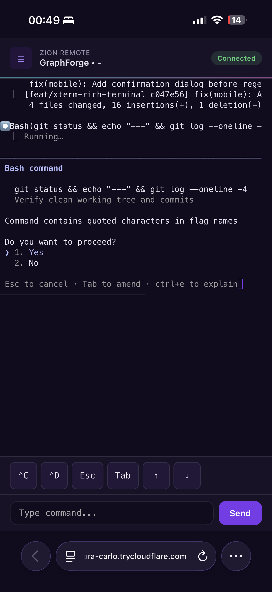
</p>

### Recovery Vault
> Never lose work again.

Zion auto-snapshots your working tree before every destructive operation — reset --hard, interactive rebase, discard all changes. If something goes wrong, restore from the Recovery Vault in Operations Center. Snapshots are named `zion-pre-{operation}` and visible in the stash list.

### Worktree-First Workflow

Create worktrees with a smart prefix+name flow, open directly into Zion Code, and keep a dedicated terminal context per worktree. In Zion Tree, switch context through worktree pills, create branches directly from Pending Changes, and copy/move pending work safely across worktrees.

<p align="center">
  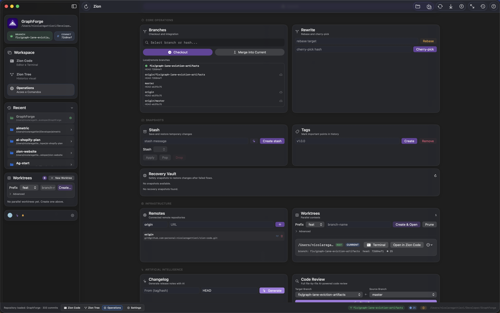
</p>

### Conflict Resolution
> Built-in. No external merge tools needed.

When a merge, rebase, or cherry-pick hits conflicts, Zion opens a dedicated resolver. A file list on the left shows conflict status with red/green icons. The inline editor on the right highlights conflict regions — **ours** (green) vs **theirs** (blue) — with one-click actions: accept ours, accept theirs, accept both, or edit manually. Once resolved, Zion auto-continues the operation.

### AI Assistant
> Wired into every Git action.

AI reads your diff and writes the commit message. AI reviews your code before you commit. AI resolves merge conflicts by reading both sides. AI explains blame entries, searches history in plain English, drafts your PR, and suggests how to split large commits. Works with Anthropic Claude, OpenAI GPT, or Google Gemini. API keys stored in macOS Keychain. Falls back to smart heuristics when AI is off.

<p align="center">
  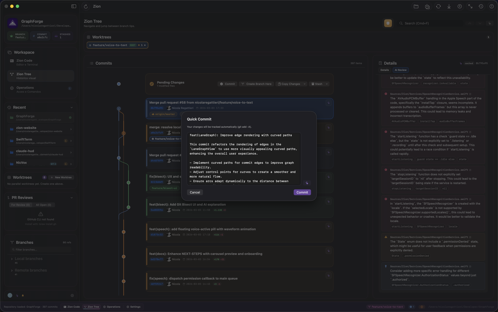
  
</p>

### Git Hosting Integration
> GitHub + GitLab + Bitbucket + Azure DevOps

Automatic provider detection from remote URLs. List open PRs, create PRs with AI-generated descriptions, post inline review comments, and submit reviews (approve/request changes). GitLab supports self-hosted instances. Bitbucket uses app passwords. Azure DevOps uses PAT authentication.

<p align="center">
  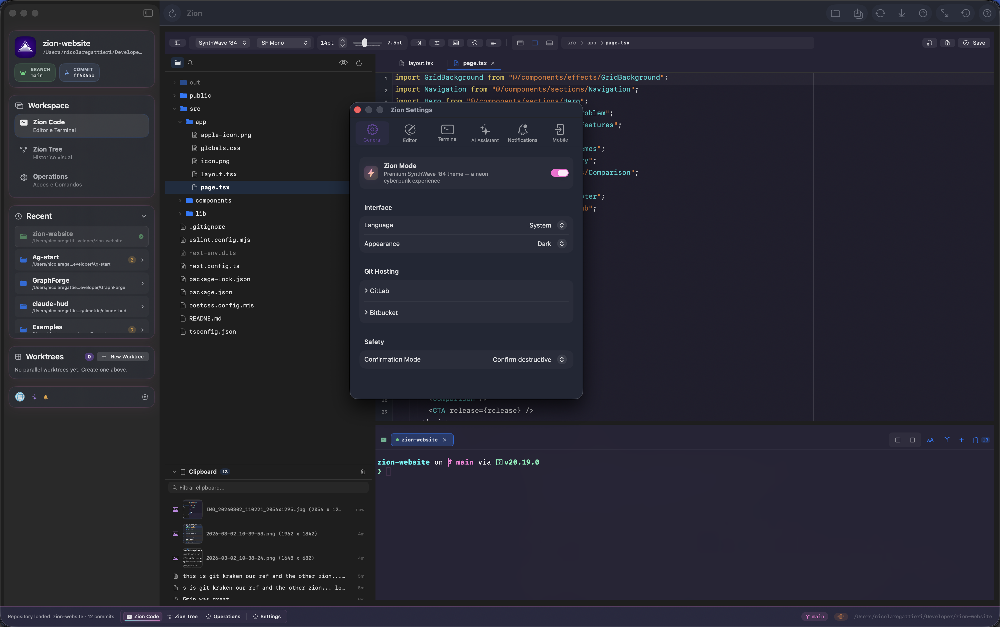
</p>

---

## Install

### Download

Grab the latest `.dmg` from [**Releases**](../../releases), open it, and drag **Zion.app** to Applications.

### Security Note

Zion release builds are signed with Apple Developer ID, notarized by Apple, and distributed from the official [**Releases**](../../releases) page.

- Download only from the official [**Releases**](../../releases) page.
- macOS may still show the standard internet-download confirmation prompt the first time you open the app.
- If you prefer, you can still build from source locally.

### Build from Source

```bash
git clone https://github.com/nicolaregattieri/zion-code.git
cd zion-code
swift build
./scripts/make-app.sh   # -> dist/Zion.app
open dist/Zion.app
```

<details>
<summary>Generate a distributable DMG</summary>

```bash
./scripts/make-dmg.sh   # -> dist/Zion.dmg
```

</details>

### Requirements

| | Minimum |
|---|---|
| macOS | 14 (Sonoma) |
| Git | Installed and in `PATH` |
| Swift | 6.0+ (build from source only) |

---

## Keyboard Shortcuts

Zion is keyboard-first. Press `Cmd+/` to see all shortcuts inside the app.

| Shortcut | Action |
|----------|--------|
| `Cmd+1` / `2` / `3` | Switch workspace (Code / Graph / Operations) |
| `Cmd+P` | Quick Open (fuzzy file search) |
| `Cmd+B` | Toggle file browser |
| `Cmd+J` | Toggle terminal |
| `Shift+Cmd+J` | Maximize terminal |
| `Cmd+T` | New terminal tab |
| `Shift+Cmd+D` | Split terminal vertical |
| `Shift+Cmd+E` | Split terminal horizontal |
| `Shift+Cmd+W` | Close split pane |
| `Cmd+S` | Save file |
| `Cmd+R` | Refresh repository status |
| `Cmd+F` | Context search (graph / editor / terminal) |
| `Shift+Cmd+F` | Find in Files |
| `Shift+Cmd+R` | Open Code Review |
| `Shift+Alt+F` | Format Document |
| `Cmd+G` | Go to line |
| `Ctrl+Cmd+Z` | Toggle Zion Mode |
| `Ctrl+Cmd+J` | Focus / Zen Mode |
| `Ctrl+Plus` / `Ctrl+Minus` | Terminal zoom in / out |

---

## Feature Reference

<details>
<summary><strong>Full feature list</strong> (click to expand)</summary>

| Area | Features |
|------|----------|
| **Graph** | Lane-colored commit cards, commit search, jump bar, branch focus, pending changes with quick actions, worktree pills with dirty status, signature verification, keyboard navigation, paginated loading (up to 5000 commits), main branch pinned to lane 0 |
| **Editor** | Syntax highlighting, Quick Open, Git Blame, 7 themes, 5+ font families, code formatter (16+ languages), format on save, bracket pair highlight, indent guides, column ruler, find/replace, find in files, go to definition, find references, markdown preview, file history, multi-tab |
| **Terminal** | Real PTY (`/bin/zsh -l`), split panes (H/V), multiple tabs, independent zoom, font config, clipboard paste/drag, Finder drag-and-drop, inline images, hyperlink detection, scrollback buffer config, process preservation |
| **Clipboard** | Auto-capture, smart categorization (command/path/hash/URL/image/text), click-to-paste, double-click-to-execute, drag-and-drop, context-aware actions (hash → Show in Graph, branch → Checkout, path → Open) |
| **Operations** | Hunk staging, line staging, interactive rebase (visual drag-reorder), cherry-pick, revert, reset (soft/hard), stash management, annotated/signed tags, custom git commands, discard changes, force push with lease |
| **Conflicts** | Built-in resolver, ours/theirs/both/custom edit, AI-powered semantic resolution, auto-continue merge/rebase/cherry-pick |
| **Branches** | Checkout, create, merge, rebase, push, pull, rename, delete, force push (with lease / override), remote tracking |
| **Tags** | Create lightweight, annotated, and GPG-signed tags; push to remote; delete local and remote tags |
| **AI** | Commit messages, diff explanations, PR descriptions, code review, conflict resolution, changelog generator, semantic search, branch summarizer, blame explainer, commit split advisor, stash messages, pre-commit review gate. Providers: Anthropic / OpenAI / Google |
| **Git Hosting** | GitHub (via `gh` CLI), GitLab (PAT, self-hosted), Bitbucket (app passwords). Auto-detection from remote URLs. PR list, create, inline comments, review submission |
| **Mobile** | QR pairing, AES-256-GCM encryption, xterm.js terminal with ANSI colors, prompt actions (approve/deny/abort), quick actions (Ctrl+C/D, Esc, Tab, arrows), multi-project sessions, Cloudflare tunnel or LAN mode, keep-awake |
| **Recovery** | Auto-snapshot before destructive ops (reset, rebase, discard), named stash refs (`zion-pre-*`), restore from Operations Center |
| **Worktrees** | Smart create (prefix+name), graph quick-switch pills, copy/move pending changes, dedicated terminal, remove/prune |
| **Remotes** | Fetch all, pull, push (normal/force-with-lease/force), divergence warning, ahead/behind badges, add/remove, connection test |
| **Submodules** | Status, init, update (recursive), sync |
| **Reflog** | Visual viewer (last 50), undo last action (soft reset) |
| **Settings** | 6 tabs (General, Editor, Terminal, AI, Notifications, Mobile), language (PT-BR/EN/ES), external editor/terminal, background fetch, ntfy push notifications |
| **Diagnostics** | Ring-buffer logger, export/copy sanitized logs |

</details>

> Full reference with descriptions and shortcuts: [`docs/FEATURES.md`](docs/FEATURES.md)

---

## Themes

<p align="center">
  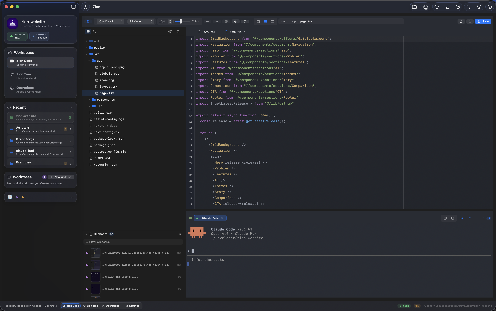
  
  
</p>

Zion ships with 7 curated editor + terminal palettes:

| Theme | Style |
|-------|-------|
| **Dracula** | Classic dark with vibrant accents |
| **Tokyo Night** | Deep indigo with soft pastels |
| **Catppuccin Mocha** | Warm dark with community-driven colors |
| **One Dark Pro** | The most popular VS Code theme |
| **City Lights** | Cool dark with muted tones |
| **GitHub Light** | Clean light theme for daytime |
| **SynthWave '84** | Neon cyberpunk (activated via Zion Mode) |

---

## Languages

Zion speaks three languages out of the box:

- **Portugues (BR)** — default
- **English**
- **Espanol**

Switch anytime in Settings, or let Zion follow your system locale.

---

## Architecture

Zion is a Swift Package (no `.xcodeproj`) built entirely with SwiftUI and Swift Concurrency.

```
ZionApp / ContentView            App shell, navigation, toolbar
  -> RepositoryViewModel         Central state (@Observable, @MainActor)
    -> RepositoryWorker          Background Git operations (async/await)
      -> GitClient               Git CLI process execution
    -> GitGraphLaneCalculator    Lane & edge layout algorithm
    -> TerminalSession           PTY management (SwiftTerm + LocalProcess)
    -> AIClient                  Anthropic / OpenAI / Gemini (actor-isolated)
    -> HostingProvider           GitHub / GitLab / Bitbucket abstraction
    -> RemoteAccessServer        Mobile terminal streaming (HTTP polling)
    -> CloudflareTunnelManager   Secure remote access tunneling
```

Design pattern: **MVVM** with Swift Observation (`@Observable`).

---

## Contributing

Zion is open source and contributions are welcome. The `master` branch is protected — all changes must go through pull requests.

Before submitting a PR:

1. Make sure `swift build` passes
2. Test your changes with `./scripts/make-app.sh && open dist/Zion.app`
3. Add L10n keys for any user-facing strings in all 3 locales

---

## License

[MIT](LICENSE) — Use it, fork it, ship it.

## Acknowledgments

- [SwiftTerm](https://github.com/migueldeicaza/SwiftTerm) by Miguel de Icaza — Terminal emulator
- [xterm.js](https://xtermjs.org/) — Mobile terminal rendering
- [Sparkle](https://sparkle-project.org/) — Auto-update framework
- [Git](https://git-scm.com/) — The engine under the hood

---

<div align="center">
<sub>Built with SwiftUI by <a href="https://github.com/nicolaregattieri">Nicola Regattieri</a></sub>
</div>
