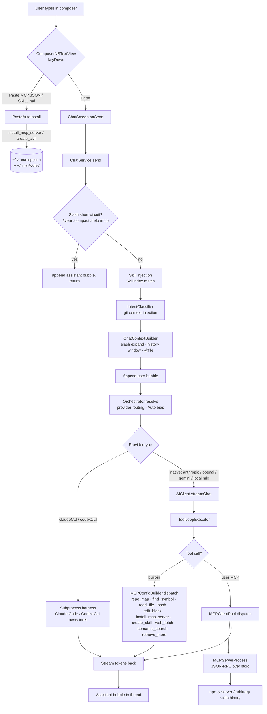

# Zion LLM Wrapper Architecture

Snapshot of how Zion Talks routes a user turn from composer to model and back, where MCP / skill extensibility plugs in, what works today and what does not. Use this as the source of truth for "can Zion handle X?" questions.

---

## 1. End-to-end turn flow

---

## 2. Component map

| Layer | File | Role |
|---|---|---|
| Composer | `Views/Chat/ComposerNSTextView.swift` · `ChatComposer.swift` | NSTextView with paste interception. Detects MCP JSON / SKILL.md before normal paste. |
| Paste auto-install | `Services/PasteAutoInstall.swift` · `ChatService+PasteAutoInstall.swift` | Recognises 3 MCP JSON shapes (`mcpServers`, single named, `{id, command, args}`) and SKILL.md frontmatter. Routes to `install_mcp_server` / `create_skill`. |
| Send orchestrator | `Services/ChatService.swift` | Owns threads, draft persistence, streaming state. Handles slash short-circuit, skill injection, intent pre-flight, conversation window. |
| Provider routing | `Services/Orchestrator.swift` | Picks provider for Auto mode based on tier table, rate limits, repo context, attachments. |
| Provider clients | `Services/AIClient*.swift` | One client per provider. CLI providers shell out to `claude` / `codex`; native providers hit HTTP / mlx. |
| Tool loop (native only) | `Services/ToolLoopExecutor.swift` | Iterates tool_use → dispatch → tool_result for native providers. CLI providers manage their own loop. |
| Tool surface | `Services/MCPConfigBuilder.swift` | Built-in tool catalog + merge with user MCP tools (`allToolsIncludingUserServers`). Built-ins take precedence by name. |
| User MCP pool | `Services/MCP/MCPClientPool.swift` (PR #527) | Actor. Warms enabled servers from registry, calls `tools/list`, builds `tool→server` routing table, dispatches via JSON-RPC. |
| Server subprocess | `Services/MCP/MCPServerProcess.swift` | One per user MCP. Foundation.Process + Pipes. JSON-RPC 2.0 client: `initialize`, `tools/list`, `tools/call`. Pending-response map keyed by id. |
| Registry | `Services/MCP/MCPRegistryStore.swift` | `~/.zion/mcp.json`. Persists user servers. |
| Skills | `Services/SkillIndex.swift` | Scans `~/.zion/skills/` (user) + `<repo>/.zion/skills/` (project) + legacy `.claude/skills/` fallback. Frontmatter + body. |
| Context builder | `Services/ChatContextBuilder.swift` | `/diff /status /log /file /commit` expansion. Git context header for first message. Mention `@file` resolution. |
| Intent classifier | `Services/IntentClassifier.swift` | Pre-flight: detects "show last commit" etc., injects git output before model sees the turn. |
| Storage | `Services/ChatStorage.swift` | Per-repo SQLite. Threads + messages. Async load races composer (fixed in PR #528). |

---

## 3. What "MCP" means in Zion today

### Compatible
| Feature | Status |
|---|---|
| stdio transport | ✅ |
| JSON-RPC 2.0 (`initialize` / `tools/list` / `tools/call`) | ✅ |
| Built-in tool name precedence over user servers | ✅ |
| Paste-to-install (3 JSON shapes) | ✅ |
| `~/.zion/mcp.json` registry | ✅ |
| Lazy warm on first dispatch | ✅ |
| User MCP tools surfaced to native providers | ✅ |

### Not compatible (gaps)
| Gap | Impact | Effort |
|---|---|---|
| HTTP / SSE / websocket transports | Hosted MCPs (Linear, GitHub remote, etc.) don't work | medium — extend `MCPServerProcess` with transport abstraction |
| MCP `resources/` and `prompts/` | Only tools surface; resources & prompt templates invisible | medium |
| OAuth / token refresh for hosted servers | Auth flow not modeled | medium-high |
| Tool descriptions schemas (JSON Schema) shown to model | Pool currently exposes name only — model misses arg shapes | small (forward `inputSchema` from `tools/list` into native provider tool block) |
| `.claude/plugins/**` plugin format (superpowers, marketplace plugins) | Plugin-shipped skills / MCPs not auto-detected | medium — extend `SkillIndex` scanner + plugin manifest parser |
| User MCPs bridged into Claude CLI subprocess | Claude CLI inside Zion only sees Claude Code's own MCP config, not `~/.zion/mcp.json` | small — pass `--mcp-config` / env when spawning CLI |
| Subagent spawn primitive (`Task` tool) for native providers | superpowers / multi-agent flows only work via Claude CLI | high — would need internal sub-ChatService loop |
| Per-tool auto-approve granularity in UI | Registry supports `autoApprove` array but UI is binary on/off | small |
| MCP server health / restart on crash | If subprocess dies mid-session, no auto-restart | small |

---

## 4. Where each LLM provider sees what

| Provider | Tool surface | Subagent capability | MCP user servers visible? |
|---|---|---|---|
| `anthropic` (API native) | Built-ins + user MCPs (via pool) | ❌ (no `Task` tool exposed) | ✅ |
| `openai` (API native) | Built-ins + user MCPs | ❌ | ✅ |
| `gemini` (API native) | Built-ins + user MCPs | ❌ | ✅ |
| `local` (mlx Qwen / others) | Built-ins + user MCPs | ❌ | ✅ |
| `claudeCLI` (subprocess) | Claude Code's own harness (Read/Edit/Bash/Grep/Glob/Task/WebFetch/...) + Claude Code's own MCP config | ✅ (`Task` tool inside Claude Code) | ❌ today — Claude CLI reads `~/.claude/` not `~/.zion/` |
| `codexCLI` (subprocess) | Codex's own harness | depends on codex version | ❌ |

**Practical implication:** if user wants superpowers / multi-agent flow inside Zion, today the only path is `claudeCLI` provider. Native providers cannot spawn subagents.

---

## 5. Proposed roadmap for "true compatibility"

Ordered by ROI:

1. **Forward tool schemas from `tools/list` into native provider tool blocks.** Cheap; immediately makes user MCPs more useful (model knows arg shapes).
2. **Bridge `~/.zion/mcp.json` into Claude CLI subprocess** via `--mcp-config` flag or temporary file written at spawn time. Unlocks all user MCPs inside CLI sessions without dual config.
3. **HTTP / SSE transport** in `MCPServerProcess`. Unlocks hosted servers (Linear, Cloudflare, etc.).
4. **`.claude/plugins/**` scanner** in `SkillIndex` + plugin manifest parser. Unlocks superpowers and similar plugin ecosystems.
5. **Subagent tool for native providers** — a `spawn_agent(task, instructions)` built-in that opens a child `ChatService` thread, runs to completion, returns transcript. Mirrors Claude Code's `Task`.
6. **MCP resources + prompts surface.** Adds `@resource:server/path` mentions + prompt-template invocation.
7. **Per-tool auto-approve UI** matching the registry's `autoApprove` array.
8. **Subprocess health monitoring + auto-restart** with backoff.

---

## 6. Self-knowledge for Zion Talks

Zion Talks does not currently RAG-index its own source. To make Zion Talks answer "how does Zion work" questions accurately:

- Add a system-prompt appendix loaded only when the active repo is GraphForge itself (detect via remote URL match).
- OR ship a packaged skill `/zion-arch` whose body is this document, so any project can ask. Trade-off: skill body counts against context window.
- OR run the RAG indexer (`ContextBuilder.semantic_search`) against `Sources/Zion/` + `docs/` at app launch when the repo is GraphForge; expose results via the regular retrieval path.

Cheapest path: ship `/zion-arch` skill containing a 200-token digest of this document, then native providers can hit it on demand without burning context on every turn.

---

*Last updated: 2026-05-29 — reflects post-PR-#527 (runtime dispatch) and post-PR-#528 (composer draft race fix).*
